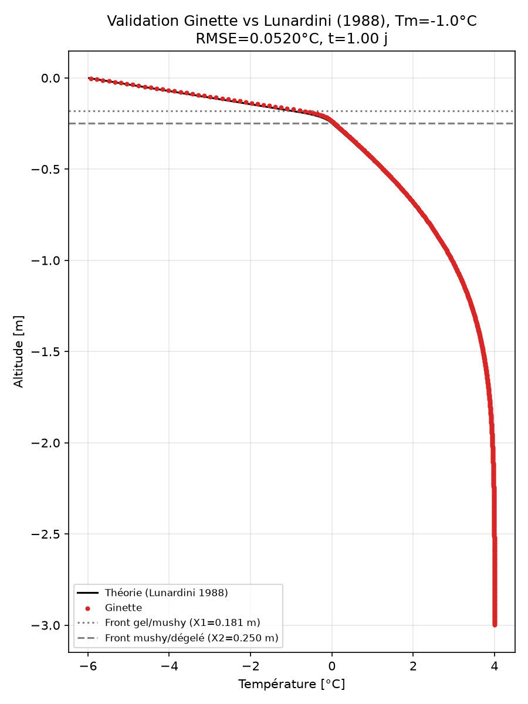

# Validation de Ginette contre la solution de Lunardini (1988) : front de gel en régime transitoire

Ce cas de test valide la physique **gel/dégel** de Ginette contre la solution analytique de
V.J. Lunardini (*Freezing of soil with an unfrozen water content and variable thermal
properties*, CRREL Report 82-2, 1988) : propagation d'un front de gel dans un milieu poreux
semi-infini, en régime transitoire.

Il s'agit du cas dit "exact", au sens où les paramètres sont choisis pour coller exactement aux
hypothèses mathématiques de la solution, quitte à ne pas être physiquement réalistes.

## Situation physique

Une colonne de sol homogène, initialement à température uniforme T0=4°C, reçoit à t=0 un palier
de température en surface Ts=-6°C (maintenu constant ensuite). Le sol contient de l'eau non
gelée même en dessous de 0°C ; Lunardini divise le profil en **3 zones** à un instant donné :

- **Zone 1 (gelée)**, 0 ≤ x ≤ X1 : seulement de l'eau résiduelle non gelée.
- **Zone 2 ("mushy")**, X1 ≤ x ≤ X2 : mélange eau/glace, teneur en glace variant linéairement
  entre les deux fronts.
- **Zone 3 (dégelée)**, x ≥ X2 : entièrement liquide, tend vers T0 loin de la surface.

## Solution analytique

Les positions des deux fronts (X1, X2) et la forme du profil de température T(x) dans chaque
zone s'expriment avec des fonctions d'erreur (erf/erfc). Avec x la profondeur depuis la surface
(positive vers le bas) et t le temps depuis le palier de température :

```
T1(x) = Ts + (Tm-Ts) * erf(ψ·x/X1) / erf(ψ)                                   [zone 1, gelée]

T2(x) = Tf + (Tm-Tf) * (erf(γ·x/X2) - erf(γ)) / (erf(γ·X1/X2) - erf(γ))       [zone 2, mushy]
        (remplacer erf par erfc si γ > 1, pour la stabilité numérique)

T3(x) = T0 - (T0-Tf) * erfc(β·x/X2) / erfc(β)                                 [zone 3, dégelée]
```

avec X1 = ψ·√(4·α1·t), X2 = γ·√(4·α4·t), β = γ·√(α4/α3), et (ψ, γ) solutions du système non
linéaire :

```
b1·exp(-ψ²·(1-a1²)) - a1·c1 · erf(ψ)/(erf(γ)-erf(a1·ψ)) = 0
b2·exp(-γ²·(1-a2²)) + a2·c2 · (erf(γ)-erf(a1·ψ))/(1-erf(a2·γ)) = 0
```

où :

```
a1 = √(α1/α4)      b1 = (Tm-Ts)/(Tf-Tm)      c1 = k2/k1
a2 = √(α4/α3)      b2 = (Tm-Tf)/(T0-Tf)      c2 = k3/k2

α1 = k1/C1     α3 = k3/C3     α4 = k2 / (C2 + γd·Lf·(ξF-ξ0)/(Tm-Tf))
```

α1 et α3 sont les diffusivités thermiques classiques des zones gelée/dégelée ; α4 est la
diffusivité "effective" de la zone mushy, où le dénominateur inclut le terme de chaleur latente
(très supérieur à C2 lui-même : c'est ce qui ralentit fortement la propagation dans la zone
mushy par rapport aux deux autres zones).

**Attention au signe** : la première équation ci-dessus comporte un `-` devant
`a1·c1·erf(ψ)/(...)`. La version publiée par McKenzie et al. (2007) y met un `+` : avec ce
signe, la résolution ne redonne pas les valeurs de référence ci-dessous (vérifié).

## Paramètres de référence (cas "exact")

```
T0 = 4.0°C      Ts = -6.0°C      Tf = 0.0°C
k1 = 3.4644     k2 = 2.9414      k3 = 2.4184      W/m/K
C1 = C2 = C3 = 690360 J/m³/K
γd = 1680 kg/m³ (densité sèche du solide)
ξF = 0.0782     ξ0 = 0.2000      (ratio massique eau non gelée / solide, gelé et dégelé)
Lf = 334720 J/kg (chaleur latente, convention "par kg d'eau")
```

Valeurs de (ψ, γ, β, X1, X2) obtenues en résolvant le système ci-dessus, X1/X2 données à 1 jour :

| Tm | ψ | γ | β | X1 (m) | X2 (m) |
|---|---|---|---|---|---|
| -4.0°C | 0.061727 | 1.397316 | 0.303371 | 0.081290 | 0.333797 |
| -1.0°C | 0.137387 | 2.060039 | 0.226950 | 0.180928 | 0.249712 |

Et à 2 jours (X1/X2 uniquement, ψ/γ/β ne dépendent pas du temps) :

| Tm | X1 à 2 jours (m) | X2 à 2 jours (m) |
|---|---|---|
| -4.0°C | 0.114962 | 0.472061 |
| -1.0°C | 0.255871 | 0.353146 |

Un troisième cas, Tm=-0.1°C, est documenté par Lunardini (ψ=0.158751, γ=5.616155,
β=0.196541, X1=0.209062 m et X2=0.216253 m à 1 jour) mais n'est pas repris ici.

## Dérivation des paramètres physiques

Trois paramètres d'entrée de Ginette demandent une conversion depuis les valeurs de Lunardini,
les autres se recopient tels quels :

- **Chaleur latente `chlat`** : Lunardini l'exprime par kg d'**eau** (Lf=334720 J/kg), Ginette
  l'attend par kg de **glace**. Conversion : Lf·ρ_eau/ρ_glace = 334720×1000/920 = **363826 J/kg**.
- **Porosité `poro`** : à partir du ratio massique eau/solide en zone dégelée (ξ0=0.2) et de la
  densité sèche du solide (γd=1680 kg/m³) : γd·ξ0/ρ_eau = 1680×0.2/1000 = **0.336**.
- **Saturation résiduelle `swressi`** : Lunardini suppose une variation linéaire de la teneur en
  eau non gelée dans la zone mushy, entre 0 (à Tf) et φmax (à Tm), avec
  φmax = (ξ0-ξF)/ξ0 = (0.2-0.0782)/0.2 = 0.609, donc swressi = 1-φmax = **0.391**.

Les conductivités k1/k2/k3 et la capacité volumique C=690360 J/m³/K sont imposées directement,
sans conversion (voir le réglage `ymoycondtherm=LUNAR` ci-dessous).

## Réglages Ginette

Le cas s'active dans `E_p_therm_bck.dat`. Trois réglages sont nécessaires **ensemble** — n'en
activer qu'une partie casse la comparaison :

- **`ymoycondtherm=LUNAR`** — impose la conductivité thermique par zone (k1 en zone gelée, k2 en
  zone mushy, k3 en zone dégelée) au lieu de la calculer par un mélange eau/glace/solide. C'est
  l'hypothèse "3 zones à conductivité constante" de Lunardini.
- **`ytest=THL`** — impose la capacité volumique constante à 690360 J/m³/K dans les 3 zones,
  plus le terme de chaleur latente apparente actif là où la teneur en glace varie avec la
  température. C'est ce terme qui reproduit la diffusivité effective α4 de la zone mushy. Ce
  réglage commande aussi l'écriture des profils complets à 1, 2 et 3 jours.
- **`ytypsice=LINEA`** — teneur en glace linéaire entre Tm et Tf, l'hypothèse exacte de
  Lunardini. **Ne pas utiliser `EXPON`** (courbe lisse) : la capacité apparente de `ytest=THL`
  est calibrée pour la pente constante de `LINEA`, et la combinaison EXPON+THL ne converge pas.

Les seuils de zones se règlent avec **`tsg`/`tsd` = Tm** (solidus, par ex. -1.0°C) et
**`tlg`/`tld` = Tf = 0°C** (liquidus). Les valeurs converties ci-dessus se mettent dans `lat`
(chaleur latente), `poro` et `swressi`.

Enfin, ce cas demande **`ysolv=BIS`** dans `E_parametre_bck.dat` : le changement de phase rend
la convergence difficile et ce solveur est nettement plus robuste ici.

Le reste du montage est un cas purement conductif : température initiale uniforme, charge
hydraulique uniforme (donc pas d'écoulement), et températures aux limites fixées de façon
constante dans `E_cdt_aux_limites_bck.dat` (`valclt_haut`/`valclt_bas`) plutôt que par une
série temporelle.

## Résultat

Domaine 3 m / 600 mailles, dt=5 s, 1 jour simulé :

| Tm | RMSE | Erreur max | X1 (m) | X2 (m) |
|---|---|---|---|---|
| -1.0°C | 0.0532°C | 0.3044°C | 0.1809 | 0.2497 |
| -4.0°C | 0.0560°C | 0.1949°C | 0.0813 | 0.3338 |

Seuil de validation : 0.5°C → **validé sur les deux valeurs de Tm**. Les positions de front
simulées (X1, X2) correspondent bien à celles de la solution analytique données plus haut.



## Lancer le cas de test

```bash
python3 lunardini_freezing.py
```

Le script boucle sur les valeurs de `Tm_list`, compile `ginette` si besoin, et écrit les
résultats (`.csv` + `.png`) dans `results/`.

**Taille du domaine** : utiliser 3 m, pas 1 m. À 1 m, la solution analytique elle-même prédit
encore T≈2.93°C (et non 4°C) au fond du domaine après 1 jour : l'hypothèse de milieu
semi-infini n'est pas encore vérifiée à cette distance du front, et la condition limite basse
imposée à T0 la contredit. L'erreur max atteint alors 1.06°C, sans que ce soit un défaut du
modèle. À 3 m, ce terme de bord devient négligeable.
