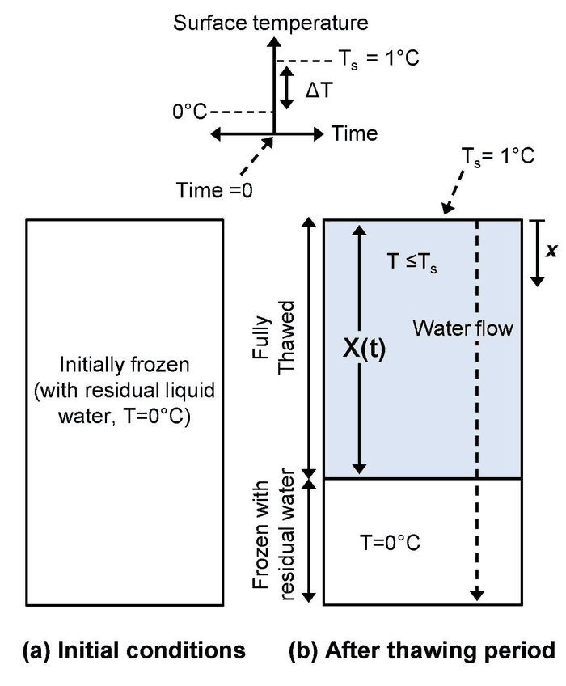
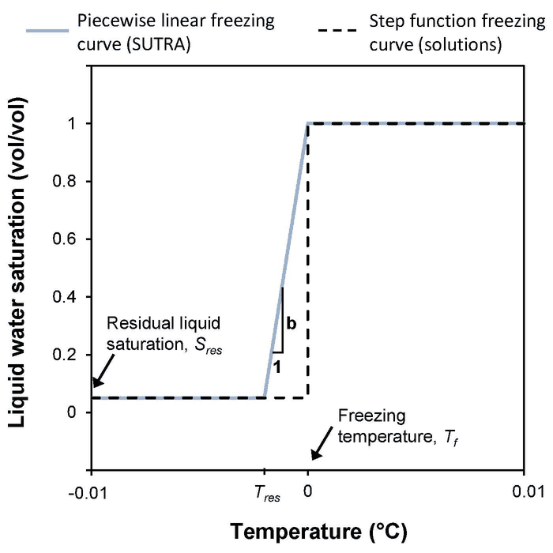
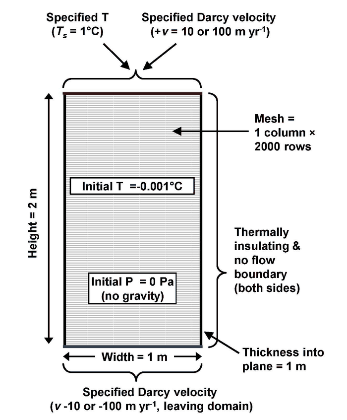
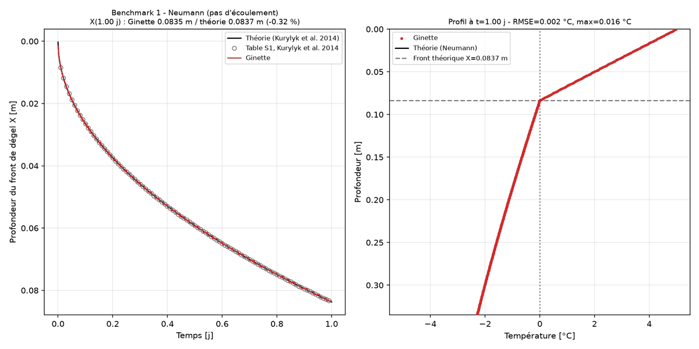
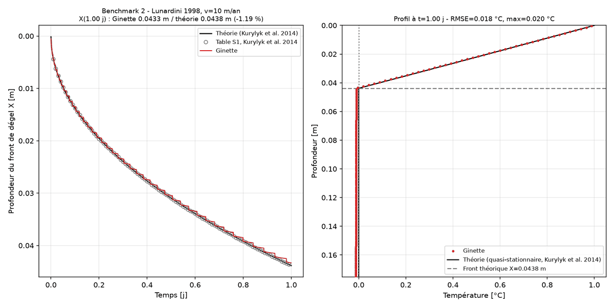
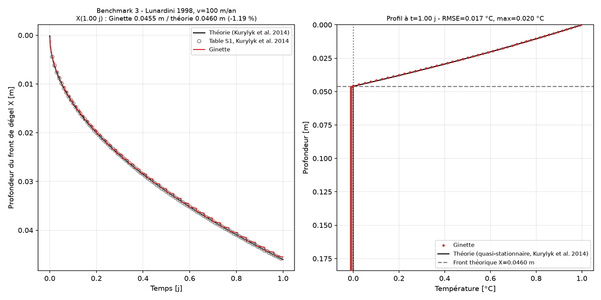

# Cas de test InterFrost TH1 : dégel 1D par conduction et advection (Neumann / Kurylyk et al. 2014)

Ce cas de test valide la physique **gel/dégel** de Ginette sur le dégel d'un sol gelé, avec et
sans écoulement, contre les trois benchmarks analytiques recommandés par B.L. Kurylyk,
J.M. McKenzie, K.T.B. MacQuarrie et C.I. Voss (*Analytical solutions for benchmarking cold
regions subsurface water flow and energy transport models: One-dimensional soil thaw with
conduction and advection*, Advances in Water Resources 70, 172-184, 2014). C'est le cas
**TH1** du projet d'intercomparaison InterFrost.

Il complète le cas [Lunardi/](../Lunardi/) (gel, conduction pure, zone "mushy") par le
problème classique de **Neumann** (dégel, front franc, conduction dans les deux phases) et par
ses deux variantes **avec advection**.

## Les trois benchmarks

Une colonne de sol saturé, initialement gelée à température uniforme Ti, reçoit à t=0 un palier
de température en surface Ts > 0°C (maintenu constant ensuite). Un front de dégel X(t) descend
dans la colonne ; dans les benchmarks 2 et 3, de l'eau percole en plus vers le bas à vitesse de
Darcy v constante.



*Schéma du problème, d'après Kurylyk et al. (2014).*

| Benchmark | Solution | Ts | Ti | Écoulement |
|---|---|---|---|---|
| 1 | Neumann (exacte, deux phases) | +5°C | −5°C | aucun |
| 2 | Lunardini (1998), quasi-stationnaire | +1°C | 0°C | v = 10 m/an vers le bas |
| 3 | idem | +1°C | 0°C | v = 100 m/an vers le bas |

Les positions du front données par les auteurs (Table S1 du matériel supplémentaire, pas de
0.01 jour jusqu'à 20 jours) sont copiées dans `reference/kurylyk2014_tableS1.csv`.

### Benchmark 1 : solution de Neumann

Avec x la profondeur depuis la surface (positive vers le bas), α_u = λ_u/C_u et α_f = λ_f/C_f
les diffusivités thermiques des zones dégelée et gelée :

```
T(x) = Ts − (Ts−Tf) · erf(x / 2√(α_u t)) / erf(λ)                          [0 ≤ x ≤ X, dégelé]
T(x) = Ti + (Tf−Ti) · erfc(x / 2√(α_f t)) / erfc(λ √(α_u/α_f))             [x ≥ X, gelé]
X(t) = 2 λ √(α_u t)
```

où λ est la racine de l'équation de Stefan (bilan d'énergie au front, L = chaleur latente
volumique du milieu) :

```
λ_u (Ts−Tf) exp(−λ²) / (√α_u · erf(λ))
  − λ_f (Tf−Ti) exp(−λ² α_u/α_f) / (√α_f · erfc(λ √(α_u/α_f)))  =  λ · L · √(π α_u)
```

Avec les paramètres ci-dessous, λ = 0.18792 et X(1 jour) = 0.0837 m.

**Signe de Ti** : ici Ti est la vraie température initiale (−5°C). Kurylyk et al. écrivent la
même formule avec Ti = "nombre de degrés sous 0°C" (positif).

### Benchmarks 2 et 3 : solution quasi-stationnaire avec advection

Le milieu est initialement à Tf = 0°C exactement (pas de gradient, donc pas de flux conductif
sous le front), et l'eau percole vers le bas à vitesse de Darcy v constante **dans tout le
domaine, y compris la zone gelée** — non physique, mais assumé par les auteurs pour obtenir une
solution fermée. Le profil dans la zone dégelée est supposé en équilibre instantané avec la
surface (conduction-advection stationnaire), d'où :

```
X + (α/v_t) · (exp(−v_t X / α) − 1) = v_t · S_T · t
T(x) = Ts + (Tf−Ts) · (exp(v_t x/α) − 1) / (exp(v_t X/α) − 1)     [0 ≤ x ≤ X]
```

avec α = λ_u/C_u, v_t = v·ρ_w c_w / C_u la vitesse du "panache" thermique, et
S_T = C_u (Ts−Tf) / L le nombre de Stefan. L'erreur de l'hypothèse quasi-stationnaire vaut
environ 15.8 × S_T (en %) — d'où le choix Ts = 1°C (S_T ≈ 0.019, erreur ≈ 0.3 %).

Les trois solutions sont implémentées dans `src/src_python/Analytical_validation.py`
(`neumann_thaw_profile`, `kurylyk_advective_thaw_front`, `kurylyk_advective_thaw_profile`) et
reproduisent la Table S1 à 0.15 mm près (la table est arrondie à 0.1 mm).

## Paramètres de référence (table InterFrost TH1)

```
Porosité                      ε   = 0.5
Conductivité dégelée / gelée  λ_u = 1.839   λ_f = 2.619   W/m/K
Capacité volumique dégelée    C_u = 3.201e6 J/m³/K    (= ε·ρ_w·c_w + (1−ε)·ρ_s·c_s, avec ρ_w c_w = 4.182e6, ρ_s = 2500, c_s = 889)
Capacité volumique gelée      C_f = 2.169e6 J/m³/K    (α_f = 1.205e-6 m²/s)
Chaleur latente volumique     L   = ε·ρ_w·Lf = 0.5 × 1000 × 334000 = 1.67e8 J/m³
Saturation résiduelle         S_res = 0.0001
Dispersivité thermique        0
Pas d'effet de la glace sur la perméabilité (k_rel off) ; gravité sans effet (flux imposé)
```

Les solutions analytiques supposent un changement de phase en échelon à Tf = 0°C. Un code
numérique a besoin d'une courbe de gel continue : Kurylyk et al. utilisent dans SUTRA une
courbe linéaire par morceaux entre T_res et 0°C, et c'est aussi ce que fait Ginette (voir
ci-dessous).



*Courbe de gel en échelon (solutions analytiques) et linéaire par morceaux (SUTRA, Ginette),
d'après Kurylyk et al. (2014).*

## Configuration de Ginette

Le domaine numérique reprend celui du papier : colonne de 2 m, maille de 1 mm, température
imposée en surface, extrémité basse maintenue à Ti (assez loin du front pour approximer le
milieu semi-infini sur la durée simulée).



*Domaine numérique utilisé par Kurylyk et al. (2014) avec SUTRA ; Ginette utilise la même
colonne, avec des charges imposées aux deux extrémités pour obtenir la vitesse de Darcy et une
température initiale de −0.02°C dans les cas avec écoulement (voir ci-dessous).*

Le cas s'active dans `GINETTE_SENSI/E_p_therm_bck.dat` avec deux mots-clés :

- **`ytest=TH1`** — force le mode dégel et écrit la position du front à chaque pas de
  sortie. `TH1` n'impose aucune valeur physique : capacité calorifique et chaleur latente
  viennent de la physique générique de Ginette.
- **`ymoycondtherm=NEUMA`** — conductivité bulk imposée à 2.619 W/m/K en zone gelée et
  1.839 W/m/K en zone dégelée, valeurs de la table InterFrost.

Tout le reste est reproduit par les fichiers d'entrée (générés par le script) :

- `omp=0.5`, `rhosi=2500`, `cpm=889`, `cpe=4182` → C_u = 3.201e6 J/m³/K.
- **Chaleur latente** : Ginette calcule la chaleur latente en dégel avec la densité de la
  **glace** (`rhoi·omp·lat`), alors que le benchmark la définit avec celle de l'**eau**
  (ε·ρ_w·Lf). On pose donc `rhoi=1000` et `lat=334000`, et on ajuste `cpice=2116` (au lieu de
  2300) pour conserver C_f = 2.169e6 J/m³/K. Avec `rhoi=920`, le front serait ~3 % trop rapide.
- `ytypsice=LINEA` (courbe de gel linéaire par morceaux), `swressi=0.0001`,
  `ytypakrice=ANNUL` (pas de réduction de perméabilité par la glace).
- **Fenêtre de changement de phase** `tsg`/`tsd` = −0.01°C, `tlg`/`tld` = 0°C. Le benchmark
  suppose un front franc ; Ginette donne le même front pour une fenêtre de −0.01, −0.05 ou
  −0.5°C, et pour un pas de temps de 1 à 60 s (voir plus bas).
- **Écoulement (benchmarks 2-3)** : `iec=1`, `ithec=1`, `g=9.81`, charges imposées en haut et
  en bas telles que v = K·Δh/L avec K = k·ρ_w·g/μ (k = 1e-12 m²), et charge initiale
  linéaire pour partir directement en régime permanent. Comme un milieu à Ti = 0°C exactement
  serait déjà dégelé pour Ginette (comme pour SUTRA), on part de Ti = −0.02°C, juste sous la
  fenêtre de phase (écart négligeable devant la chaleur latente : C_f × 0.02 / L ≈ 3·10⁻⁴).
- `ysolv=BIS` (BiCGSTAB préconditionné), recommandé pour tous les cas gel/dégel.

## Résultats

Domaine 2 m, dz = 1 mm, dt = 10 s, 1 jour simulé. Position du front prise sur l'isotherme
0°C, qui est la définition du benchmark ("shallowest node below 0°C") :

| Benchmark | X(1 j) Ginette | X(1 j) théorie | Écart | RMSE sur X(t) | Profil T : RMSE / max | v Darcy Ginette | Temps CPU |
|---|---|---|---|---|---|---|---|
| 1 Neumann | 0.0835 m | 0.0837 m | −0.3 % | 0.25 mm | 0.0025°C / 0.016°C | — | 25 s |
| 2 v = 10 m/an | 0.0433 m | 0.0438 m | −1.2 % | 0.37 mm | 0.018°C / 0.020°C | 10.001 m/an | 25 s |
| 3 v = 100 m/an | 0.0455 m | 0.0460 m | −1.2 % | 0.29 mm | 0.017°C / 0.020°C | 100.006 m/an | 25 s |

**Les trois benchmarks sont validés.**







Les écarts résiduels s'expliquent tous :

- Pour les benchmarks 2-3, l'écart de 0.02°C sur le profil est l'écart Ti = −0.02°C / 0°C
  sous le front. Dans la zone dégelée, l'écart est de 0.008°C RMSE / 0.014°C max à
  v = 100 m/an, Ginette étant légèrement plus froide que le profil quasi-stationnaire, comme
  attendu d'un calcul transitoire.
- L'écart de −1.2 % sur le front cumule la discrétisation (≈ dz/2 = 0.5 mm sur 45 mm, le même
  −0.5 mm qu'on observe aux temps courts sur Neumann) et l'erreur propre de la solution
  quasi-stationnaire (≈ 0.3 %, qui surestime X en négligeant la chaleur sensible de la zone
  dégelée).

**Sensibilité à la discrétisation** (benchmark 1, position du front à t = 1200 s, théorie
9.87 mm) : dz = 2 mm donne 9.0 mm et dz = 1 mm donne 9.5 mm, quels que soient dt (1 à 60 s) et
la fenêtre de phase (−0.01 à −0.5°C). Seule la taille de maille compte (erreur ≈ dz/2 sur la
position du front aux temps courts) ; elle devient négligeable à 1 jour (X ≈ 84 mailles).

## Lancer le cas de test

```bash
python3 neumann_thawing.py            # benchmark 1 (Neumann) seul
python3 neumann_thawing.py 1 2 3      # les trois benchmarks
python3 neumann_thawing.py 1 --days 2 --dz 0.002 --dt 60 --tres -0.05   # étude de sensibilité
```

Dépendances Python : numpy, pandas, matplotlib (et celles de `src/src_python`).

Le script compile `ginette` si besoin, génère les fichiers d'entrée dans `GINETTE_SENSI/`,
lance la simulation et écrit dans `results/` : `neumann_front_<cas>.csv` (X(t) Ginette et
théorie), `neumann_profile_<cas>.csv` (profil T final), `neumann_front_<cas>.png`,
`neumann_summary.csv` et le log Ginette. Avec des options non standard, les noms de fichiers
portent un suffixe (`_2d_dz2mm_dt60s_tres-0.05`).

**Durée simulée** : la Table S1 va jusqu'à 20 jours, mais le domaine de 2 m n'approxime plus
le milieu semi-infini au-delà de quelques jours (la perturbation thermique en zone gelée
s'étend sur ~2√(α_f t), soit 1.4 m à 20 jours) : utiliser `--depth 5` ou plus pour aller
au-delà de 3-4 jours.

## Contenu du dossier

```
neumann_thawing.py               script de validation (génère les entrées, lance Ginette, compare, trace)
GINETTE_SENSI/                   templates d'entrée Ginette (E_*_bck.dat) et répertoire de calcul
reference/kurylyk2014_tableS1.csv  positions du front publiées (Table S1)
figures/                         schémas (d'après Kurylyk et al. 2014) et figures de résultats du README
results/                         sorties du script (régénérées à chaque exécution)
```
