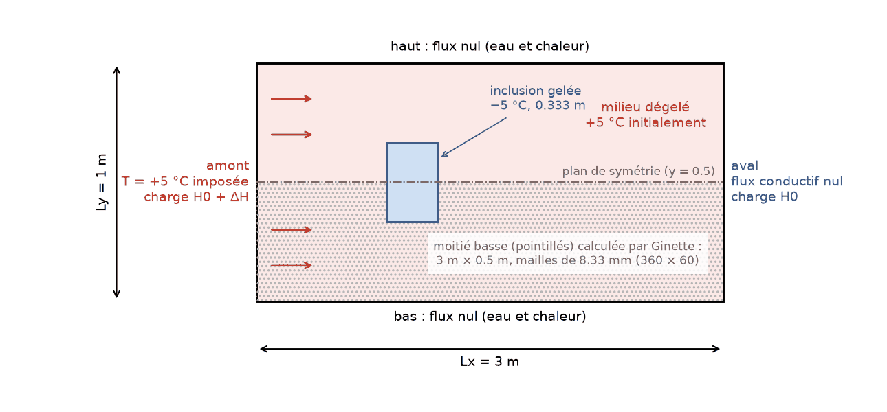
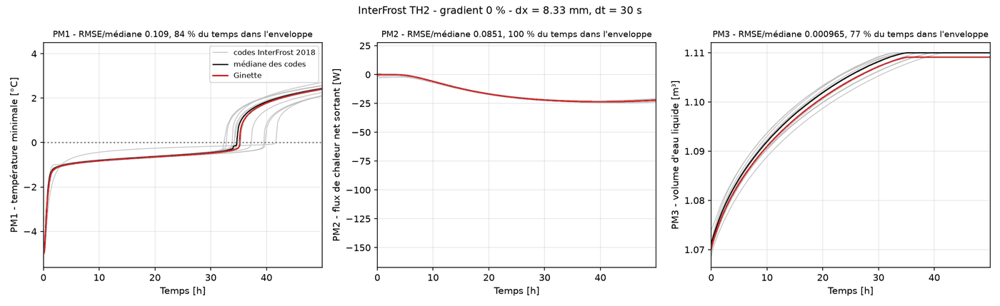
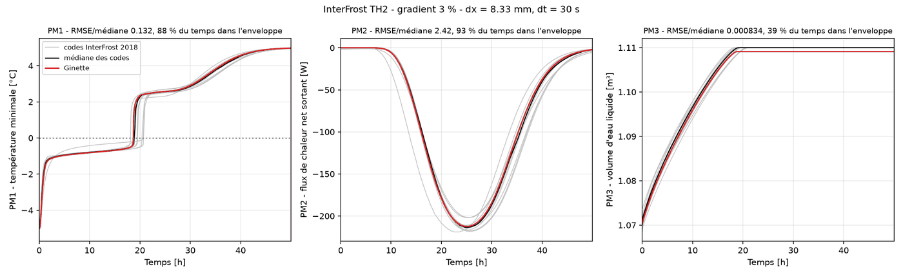
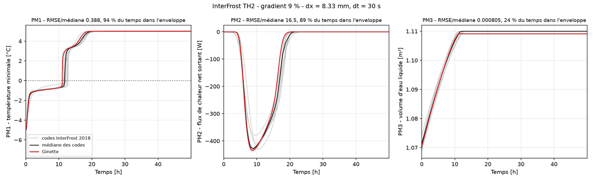
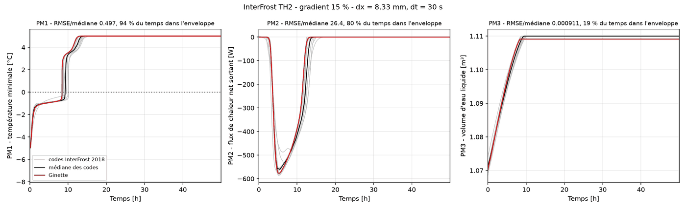

# Cas de test InterFrost TH2 : dégel d'une inclusion gelée dans un écoulement (Grenier et al. 2018)

Ce cas de test confronte la physique **gel/dégel couplée à l'écoulement** de Ginette, en 2D, au
premier cas de l'intercomparaison InterFrost sans solution analytique : C. Grenier et al.,
*Groundwater flow and heat transport for systems undergoing freeze-thaw: Intercomparison of
numerical simulators for 2D test cases*, Advances in Water Resources 114, 196-218, 2018, dont
Ginette et son autrice sont co-signataires. Treize codes y ont participé ; la référence est
l'enveloppe de leurs résultats, publiée sur le site du projet (wiki.lsce.ipsl.fr/interfrost),
et les courbes de Ginette de 2018 en font partie. Ce dossier rejoue le cas avec la version
actuelle du code.

Il complète les cas 1D [Lunardi/](../Lunardi/) (gel, conduction) et [Neumann/](../Neumann/)
(dégel, conduction et advection) par un cas **2D avec écoulement contourné par la zone
gelée**, où la perméabilité dépend de la teneur en glace.

## Le problème

Un domaine de 3 m × 1 m, saturé, initialement à +5 °C, contient une inclusion carrée gelée de
0.333 m de côté à −5 °C, centrée en (1, 0.5). De l'eau à +5 °C entre par la face amont
(gauche) sous un gradient de charge imposé et ressort par la face aval ; les faces haut et bas
sont imperméables et isolées. L'inclusion, quasi imperméable tant qu'elle est gelée, dévie
l'écoulement puis se dégrade par conduction et par advection de chaleur ; le panache d'eau
froide qu'elle libère est ensuite emporté vers l'aval. Quatre gradients de charge sont
étudiés : **0 %** (conduction pure), **3 %**, **9 %** et **15 %**.



*Géométrie et conditions aux limites. Par symétrie, Ginette ne calcule que la moitié basse du
domaine (plan de symétrie en y = 0.5).*

Mesures de performance (PM) de l'intercomparaison, pour le domaine complet et une épaisseur
transverse de 1 m :

- **PM1** : température minimale du domaine au cours du temps, et **temps de seuil** auquel
  elle repasse au-dessus de 0 °C (fin du dégel de l'inclusion) ;
- **PM2** : flux de chaleur net sortant du système, J_out − J_in, intégrale sur les faces aval et
  amont du flux advectif ρ_w c_w T U_x et du flux conductif −λ ∂T/∂x (W) ;
- **PM3** : volume total d'eau liquide dans le domaine (m³).

## Paramètres de référence (fiche InterFrost TH2)

```
Porosité                     ε     = 0.37
Perméabilité intrinsèque     k     = 1.3e-10 m²          (K = k ρ_w g / μ = 7.1e-4 m/s)
Compressibilité équivalente  β     = 1e-8 Pa⁻¹
Viscosité                    μ     = 1.793e-3 kg/m/s
Conductivités thermiques     λ_w = 0.6   λ_i = 2.14   λ_s = 9   W/m/K
Capacités massiques          c_w = 4182  c_i = 2060   c_s = 835 J/kg/K
Masses volumiques            ρ_w = 1000  ρ_i = 920    ρ_s = 2650 kg/m³
Chaleur latente              L     = 3.34e5 J/kg
Courbe de gel                S_w(T) = S_res + (1 − S_res) exp(−(T/W)²) pour T < 0,  W = 0.5 K, S_res = 0.05
Perméabilité relative        k_r = max(10^(−Ω S_i), 1e-6),  Ω = 50
Conductivité équivalente     λ_eq = ε (S_w λ_w + S_i λ_i) + (1 − ε) λ_s   (moyenne arithmétique)
```

## Configuration de Ginette

Le cas s'active dans `GINETTE_SENSI/E_p_therm_bck.dat` avec `ytest=TH2` : Ginette initialise
l'inclusion (−5 °C, saturation en glace 0.95) et écrit les trois mesures de performance à
chaque pas de sortie dans `S_TH2.dat`, ainsi que le champ final dans `S_pts`. Les autres
réglages reproduisent la fiche par les fichiers d'entrée (générés par le script) :

- **Domaine** : moitié basse, 3 m × 0.5 m, mailles carrées de 8.33 mm (360 × 60 = 21 600
  mailles), plan de symétrie en haut (flux nuls). `ixy=0` : pas de terme gravitaire, les
  charges imposées à gauche (ΔH = gradient × 3 m) et à droite (0) sont directement des
  pressions ; charge initiale uniforme égale à la charge aval.
- **Physique** : `omp=0.37`, `akx=akz=1.3e-10`, `ss=1e-8`, `amu=1.793e-3`, `rhosi=2650`,
  `cpm=835`, `alandam=9`, `alandae=0.6`, `alandai=2.14`, `cpe=4182`, `cpice=2060`,
  `rhoi=920`, `lat=334000`, `ymoycondtherm=ARITH`.
- **Courbe de gel** : `ytypsice=EXPON` avec `cimp=0.5` (le paramètre W) et `swressi=0.05`.
- **Perméabilité relative** : `ytypakrice=MCKEN`, la formule de la fiche (McKenzie et al.
  2007) avec `omega=50` et plancher `dk=1e-6`.
- **Conditions aux limites** : température +5 °C imposée à gauche, flux conductif nul
  ailleurs ; charges imposées à gauche et à droite (`icl=-2`), flux nul en haut et en bas. Pour
  le gradient 0 %, l'écoulement est désactivé (`iec=0`).
- **Solveur linéaire** : `ysolv=ILU` (BiCGSTAB préconditionné ILU(0)), adapté au système de
  pression de ce cas où la perméabilité varie de six ordres de grandeur entre l'inclusion
  gelée et le milieu dégelé.
- Pas de temps 30 s (10, 30 et 60 s donnent le même temps de seuil à 0.6 % près), 180 000 s
  simulées (50 h), enregistrement des PM toutes les 100 s.

## Résultats

Domaine 3 m × 1 m (moitié modélisée), maille de 8.33 mm, pas de temps 30 s, 50 h simulées.
Ginette reproduit les trois mesures de performance de l'intercomparaison pour les quatre
gradients de charge. Le temps de seuil (retour de la température minimale au-dessus de 0 °C,
fin du dégel de l'inclusion) se compare comme suit à l'ensemble des codes participants :

| Gradient | Temps de seuil Ginette | Ensemble des codes (médiane) |
|---|---|---|
| 0 % (conduction pure) | 35.2 h | 32.4 – 41.7 h (34.7 h) |
| 3 % | 18.7 h | 18.1 – 20.7 h (18.9 h) |
| 9 % | 11.1 h | 10.8 – 12.8 h (11.8 h) |
| 15 % | 8.4 h | 8.6 – 10.1 h (9.2 h) |

Plus le gradient hydraulique est fort, plus l'advection de chaleur accélère le dégel : le temps
de seuil passe de 35 h sans écoulement à 8 h à 15 %. Les courbes de Ginette (température
minimale, flux de chaleur net, volume d'eau liquide) se placent dans l'enveloppe des codes de
l'intercomparaison tout au long de la simulation, sans aucune coupure de pas de temps.

**Gradient 0 % (conduction pure)**


**Gradient 3 %**


**Gradient 9 %**


**Gradient 15 %**


Sur chaque figure : en gris les treize codes de l'intercomparaison (dont Ginette 2018), en noir
leur médiane, en rouge Ginette. **Le cas TH2 est validé sur les quatre gradients.**

## Lancer le cas de test

```bash
python3 th2_frozen_inclusion.py             # les quatre gradients (0, 3, 9, 15 %)
python3 th2_frozen_inclusion.py 3 9         # une sélection
python3 th2_frozen_inclusion.py 3 --dx 0.025 --dt 60 --tend 100000   # étude de sensibilité
```

Dépendances Python : numpy, pandas, matplotlib (et celles de `src/src_python`).

Le script compile `ginette` si besoin (avec `-O2`), génère les fichiers d'entrée dans
`GINETTE_SENSI/` à partir des templates `E_*_bck.dat`, lance la simulation et écrit dans
`results/` : `th2_pm_GH<g>.csv` (PM1-3 au cours du temps), `th2_field_GH<g>.csv` (champ final
de température, saturation et pression), les figures `th2_pm_GH<g>.png` et
`th2_field_GH<g>.png`, `th2_summary.csv` et le log Ginette. Avec des options non standard, les
noms de fichiers portent un suffixe (`_dx25mm_dt60s_t100000s`). Compter environ une heure par
gradient sur le maillage de référence (quelques minutes avec `--dx 0.025`).

## Contenu du dossier

```
th2_frozen_inclusion.py          script de validation (génère les entrées, lance Ginette, compare, trace)
GINETTE_SENSI/                   templates d'entrée Ginette (E_*_bck.dat) et répertoire de calcul
reference/interfrost2018_th2_pm.csv  mesures de performance des 13 codes de l'intercomparaison (site InterFrost)
figures/                         schéma et figures de résultats du README
results/                         sorties du script (régénérées à chaque exécution)
```

Les outils communs aux deux cas 2D (lecture des sorties binaires, courbes de référence,
comparaison à l'enveloppe) sont dans `src/src_python/Interfrost_2D.py`.
