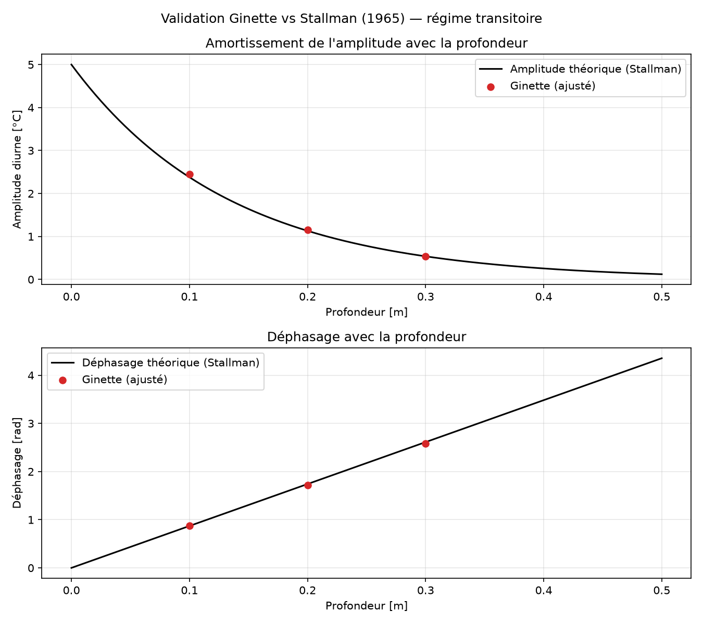
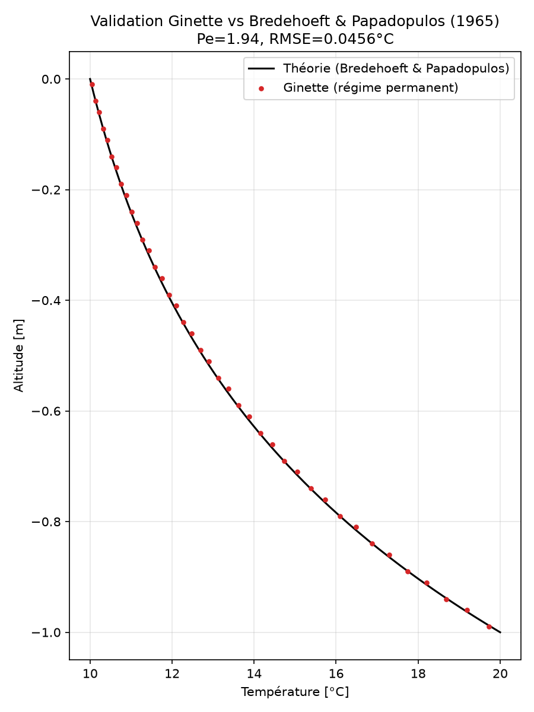
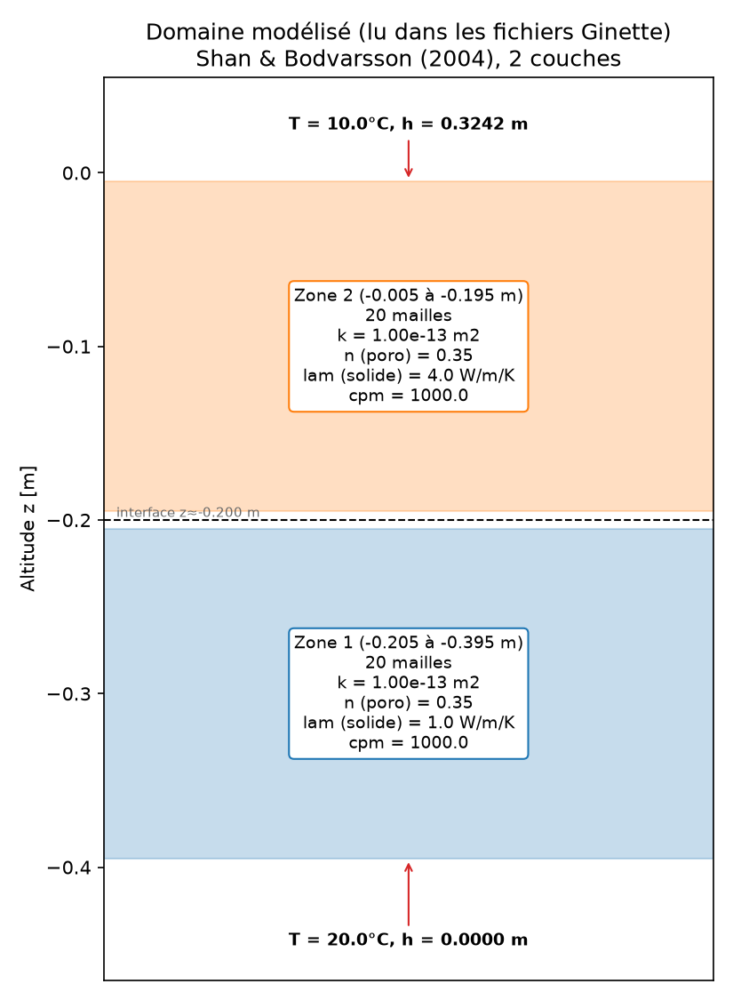
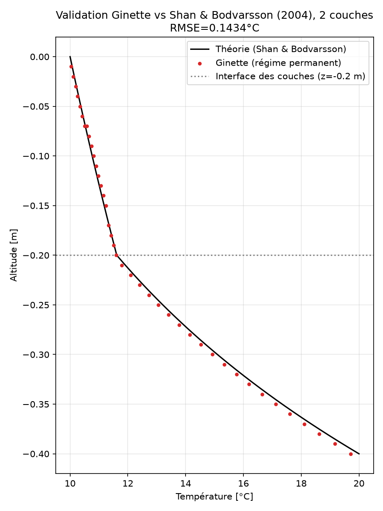
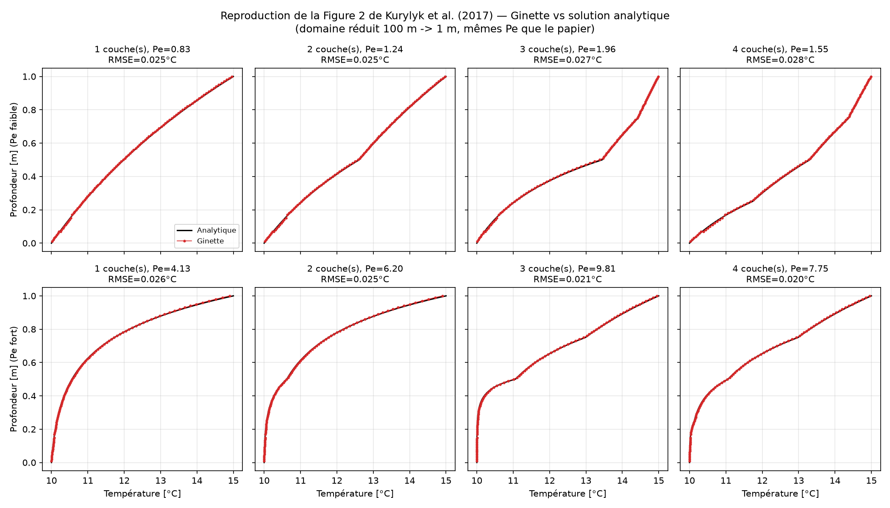

# Vérification et validation du moteur de transport de chaleur de Ginette contre 4 solutions analytiques de référence

Comme pour tout code de simulation utilisé en recherche (MODFLOW, PFLOTRAN, SUTRA...), la
crédibilité du moteur de transport de chaleur de Ginette repose sur sa capacité à reproduire des
solutions connues avant d'être appliqué à des cas réels où aucune solution de référence
n'existe. Ce dossier rassemble 4 cas de **vérification et validation (V&V)** qui comparent la
sortie numérique de Ginette à des **solutions mathématiques exactes** publiées dans la
littérature hydrogéologique de référence. Dans certaines situations idéalisées (milieu
homogène, écoulement constant...), la température attendue dans le sous-sol peut être calculée
analytiquement, sans simulateur. Ginette reproduit ces solutions de référence avec des écarts
inférieurs au dixième de degré, y compris sur les configurations les plus exigeantes (milieux
stratifiés à fort contraste de conductivité thermique).

Les 4 cas montent en complexité : signal transitoire en milieu homogène → régime permanent en
milieu homogène → régime permanent en milieu stratifié à 2 couches → régime permanent en
milieu stratifié à 1, 2, 3 ou 4 couches. Chacun isole un aspect différent du calcul, de sorte
que l'ensemble couvre le comportement transitoire, l'équilibre advection/diffusion, et le
traitement des interfaces de matériaux.

## Principe commun aux scripts

1. On choisit des paramètres physiques **connus à l'avance** (perméabilité, porosité,
   conductivité thermique, flux d'eau...).
2. On calcule la température attendue avec la formule analytique du papier correspondant.
3. On lance Ginette avec exactement les mêmes paramètres et les mêmes conditions aux limites.
4. On superpose les deux courbes (théorie vs Ginette) et on mesure l'écart.

Chaque script est autonome (`python3 N_....py`) : il configure Ginette, le compile si besoin,
lance la simulation, calcule l'erreur et génère une figure dans `results/`.

---

## Cas 1 — Stallman (1965) : signal de température sinusoïdal en surface

**Fichier** : `1_stallman_transient.py`

**Ce qu'on teste** : le comportement **transitoire** de Ginette — sa capacité à propager dans
le temps un signal qui varie (ici un cycle jour/nuit de température en surface), combiné à un
écoulement d'eau constant vers le bas.

**Situation physique** : imaginez un sol homogène (même matériau partout) dans lequel la
température de surface oscille chaque jour entre 10°C et 20°C (moyenne 15°C, amplitude 5°C).
De l'eau s'infiltre en continu à travers le sol à une vitesse constante. Stallman (1965) a
montré que ce signal, en descendant, s'**amortit** (l'amplitude diminue avec la profondeur) et
se **déphase** (le pic de température arrive de plus en plus tard). La vitesse d'amortissement
et de déphasage dépend directement de la vitesse d'infiltration de l'eau — c'est même la base
des méthodes de terrain qui estiment un débit d'infiltration à partir de mesures de
température à différentes profondeurs.

**Ce que fait le script** : il calcule l'amortissement/déphasage théorique, lance Ginette 20
jours (10 jours pour que le régime s'établisse + 10 jours de comparaison), puis ajuste un
sinus sur la température simulée à 3 profondeurs (0.1, 0.2, 0.3 m) pour en extraire
l'amplitude et la phase numériques.

**Résultat attendu** : `Ginette (ajusté)` (points rouges) doit tomber sur la courbe théorique
(noire) pour l'amortissement ET le déphasage.



**Critère de validation** : erreur relative max sur l'amplitude < 10%.
**Résultat actuel : 2.76%** → validé.

---

## Cas 2 — Bredehoeft & Papadopulos (1965) : profil vertical en régime permanent

**Fichier** : `2_bredehoeft_papadopulos_steady.py`

**Ce qu'on teste** : le **régime permanent** (une fois que tout s'est stabilisé, plus de
variation dans le temps) en milieu homogène — la brique de base sur laquelle repose le cas 3.

**Situation physique** : un sol homogène, avec une température fixe imposée en haut (10°C) et
une autre en bas (20°C) du domaine, et un flux d'eau constant qui traverse toute la colonne.
Sans écoulement, le profil de température serait une simple droite entre les deux bords
(diffusion pure). Avec de l'eau qui descend, elle "transporte" de la chaleur vers le bas et
courbe ce profil — plus le flux d'eau est fort par rapport à la diffusion thermique du
matériau (rapport appelé nombre de Péclet), plus la courbure est marquée. Bredehoeft &
Papadopulos (1965) donnent la formule exacte de cette courbe.

**Ce que fait le script** : impose les deux températures et une charge hydraulique calculée
pour obtenir le flux d'eau visé, laisse Ginette tourner jusqu'à stabilisation (régime
permanent), puis compare le profil de température maille par maille à la formule.



**Critère de validation** : RMSE < 0.5°C (sur un écart total haut/bas de 10°C).
**Résultat actuel : RMSE = 0.046°C** → validé.

---

## Cas 3 — Shan & Bodvarsson (2004) : régime permanent, 2 couches de conductivité différente

**Fichier** : `3_shan_bodvarsson_layered.py`

**Ce qu'on teste** : la capacité de Ginette à gérer correctement une **interface entre deux
matériaux différents** — c'est le cas le plus exigeant des 3.

**Situation physique** : identique au cas 2 (mêmes températures imposées en haut/bas, même
flux d'eau constant), mais le sous-sol est maintenant composé de **2 couches** de conductivité
thermique différente (ici un facteur 4 entre les deux, pour bien voir l'effet). Shan &
Bodvarsson (2004) étendent la formule de Bredehoeft & Papadopulos à ce cas multi-couches : le
profil de température doit changer de courbure exactement à l'interface entre les deux zones.

Le script produit une **figure du domaine modélisé**, générée directement à partir des
fichiers que Ginette a réellement reçus (pas des paramètres du script Python) — utile pour
vérifier que la géométrie et les zones sont bien celles qu'on croit avoir configurées :



Et la comparaison du profil de température à la formule théorique :



**Critère de validation** : RMSE < 0.5°C.
**Résultat actuel : RMSE = 0.14°C** → validé.

---

## Cas 4 — Kurylyk et al. (2017) : régime permanent, 1 à 4 couches, reproduction de leur Figure 2

**Fichier** : `4_kurylyk_multilayer.py`

**Ce qu'on teste** : le même phénomène que le cas 3 (interfaces entre matériaux), mais poussé
plus loin — jusqu'à 4 couches au lieu de 2, sur 4 configurations différentes et 2 flux d'eau
par configuration (8 simulations Ginette au total).

**Situation physique** : Kurylyk, Irvine, Carey, Briggs, Werkema & Bonham (2017, *Hydrological
Processes* 31, 2648-2661) re-présentent et corrigent la solution de Shan & Bodvarsson (2004)
déjà utilisée au cas 3 (c'est en fait la version implémentée dans
`src/src_python/Analytical_validation.py` — voir la note "gamma" dans le code). Leur papier
compare cette solution à des simulations SUTRA (un code éléments finis de l'USGS) pour des
empilements de 1, 2, 3 et 4 couches de conductivité thermique différente (leur Table 1), à 2
flux d'eau par empilement. Leur Figure 2 montre que plus il y a de couches, plus le profil de
température s'écarte de la simple courbe concave du cas homogène — avec un changement net de
pente à chaque interface.

**Ce que fait le script** : reproduit cette Figure 2 en utilisant **Ginette à la place de
SUTRA**. Les conductivités et les épaisseurs relatives des couches sont reprises exactement de
leur Table 1 ; le domaine total est réduit de 100 m à 1 m (comme au cas 2/3 : sur 100 m, le
temps de mise en régime permanent se compterait en siècles), mais le flux d'eau de chaque
scénario est recalculé pour conserver **exactement les mêmes nombres de Péclet thermiques**
que le papier (le rapport advection/diffusion qui gouverne la forme du profil) — le profil
obtenu a donc rigoureusement la même forme que celui de la Figure 2 originale, à une échelle
différente.



**Critère de validation** : RMSE < 0.5°C sur chacune des 8 combinaisons (4 empilements × 2
flux).
**Résultat actuel : RMSE max = 0.028°C** (les 8 nombres de Péclet visés sont atteints
exactement) → validé.

---

## Lancer les cas de test

Depuis ce dossier :

```bash
python3 1_stallman_transient.py
python3 2_bredehoeft_papadopulos_steady.py
python3 3_shan_bodvarsson_layered.py
python3 4_kurylyk_multilayer.py
```

Chaque script compile automatiquement `ginette` depuis `src/ginette_V2.f90` s'il n'existe pas
encore dans `GINETTE_SENSI/` (dossier de travail partagé par les 4 cas). Les résultats
(courbes `.png` + tableaux `.csv`) sont écrits dans `results/`.

## Récapitulatif

| Cas | Régime | Milieu | Ce qu'il valide | Erreur |
|---|---|---|---|---|
| 1. Stallman (1965) | Transitoire | Homogène | Propagation d'un signal variable dans le temps + advection | 2.76% (amplitude) |
| 2. Bredehoeft & Papadopulos (1965) | Permanent | Homogène | Équilibre advection/diffusion en régime stabilisé | RMSE 0.046°C |
| 3. Shan & Bodvarsson (2004) | Permanent | 2 couches | Traitement d'une interface entre matériaux différents | RMSE 0.14°C |
| 4. Kurylyk et al. (2017) | Permanent | 1 à 4 couches | Idem cas 3, généralisé à plusieurs interfaces (reproduction de leur Fig. 2) | RMSE max 0.028°C |

## Bilan de la vérification

Sur les 4 régimes physiques les plus couramment rencontrés en traçage thermique des eaux
souterraines — signal transitoire, régime permanent homogène, et régime permanent stratifié
jusqu'à 4 couches de conductivité contrastée — le moteur de transport de chaleur de Ginette
reproduit les solutions analytiques de référence de la littérature (Stallman 1965 ; Bredehoeft
& Papadopulos 1965 ; Shan & Bodvarsson 2004 ; Kurylyk et al. 2017) avec des écarts de quelques
centièmes à quelques dixièmes de degré. Ces cas de test, exécutables en quelques minutes
(`python3 N_....py`), sont directement reproductibles par toute personne souhaitant vérifier
ces résultats indépendamment.